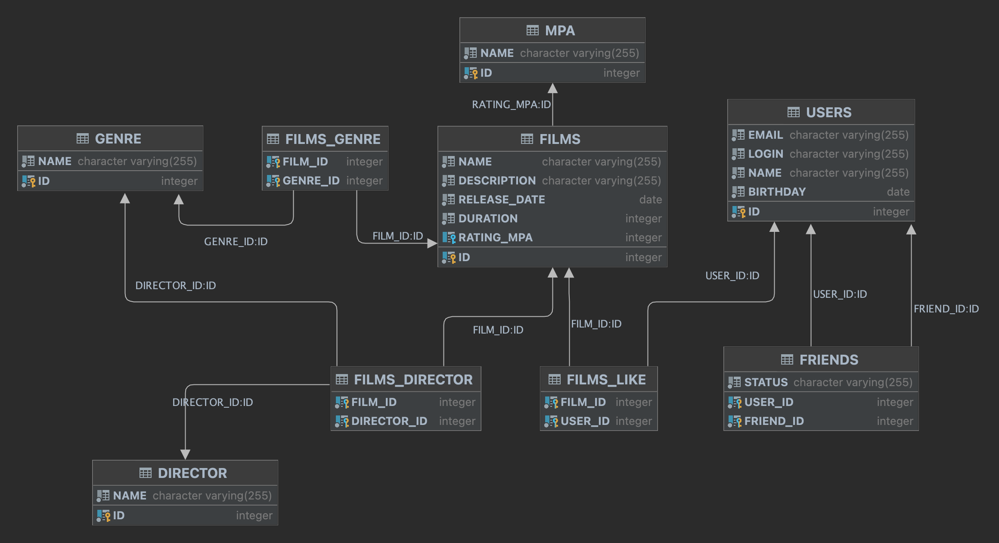

# java-filmorate
Template repository for Filmorate project.

## DB ER Diagram


### SQL query example

Получение всех фильмов
```sql
SELECT * FROM film
```

Получение всех пользователей
```sql
SELECT * FROM user
```

Получение топ N наиболее популярных фильмов
```sql
SELECT
    f.name,
    count(f.name)
FROM film as f
LEFT JOIN film_like as fl on f.film_id = fl.film_id
GROUP BY f.film_id
LIMIT N
```

Получение списка общих друзей у пользователей с user_id = 1  и 2
```sql
SELECT
    friend_id
FROM friend
WHERE user_id IN (1,2)
GROUP BY friend_id
HAVING count(friend_id) > 1;
```